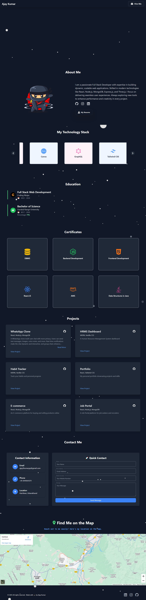

# 🚀 My Awesome Portfolio

Welcome to my **My Awesome Portfolio**! This project showcases my skills, experience, and tech stack in a beautifully designed and interactive way. Built using **React.js, Vite, Tailwind CSS, and Three.js**, it delivers a seamless and visually appealing experience.

## 🌟 Features

- 🔥 **Modern UI/UX** – A sleek and professional design using Tailwind CSS.
- 🎨 **Three.js Integration** – 3D animations for an immersive experience.
- 🖥️ **Responsive Design** – Fully optimized for all screen sizes.
- 🛠️ **Technology Stack Slider** – Showcasing my tech skills with icons and smooth animations.
- ⚡ **Fast Performance** – Optimized with Vite for lightning-fast load times.

## 🛠️ Tech Stack

- **Frontend:** React.js, Vite, Tailwind CSS, Three.js
- **Deployment:**  Netlify

## 📸 Screenshots



## 🚀 Installation & Setup

1. Clone the repository:
   ```sh
   git clone https://github.com/ajaykumar2pp/My-Portfolio
   ```
2. Navigate to the project folder:
   ```sh
   cd my-portfolio
   ```
3. Install dependencies:
   ```sh
   npm install
   ```
4. Run the project locally:
   ```sh
   npm run dev
   ```
5. Open your browser and visit: `http://localhost:5173/`

## 🌍 Live Demo

[🔗 Check out the live portfolio here!](https://ajay-portfolio-dev.netlify.app/)

## 📬 Contact Me

- 💼 [LinkedIn](https://www.linkedin.com/in/ajay-kumar-6a041b1ba)
- 📧 Email: ajay2kumarpp@gmail.com


 

🌟 **If you like this project, give it a star! ⭐**
